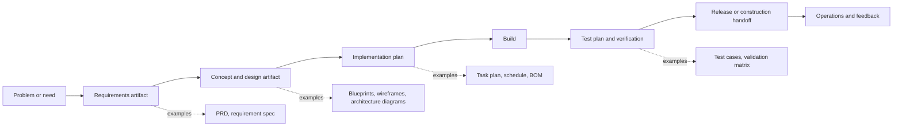
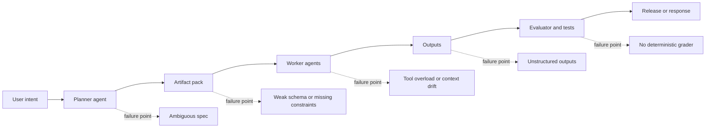

# Agentic systems, engineering artifacts, and why scale breaks

## Executive summary

The strongest recent evidence points in the same direction: agentic systems struggle to scale to complex engineering challenges when they are treated as piles of prompts and raw context rather than as engineered pipelines with explicit artifacts, bounded interfaces, and disciplined verification. Anthropic reports that successful agent implementations tend to use simple, composable patterns rather than elaborate frameworks, and OpenAI recommends maximizing a single agent first because additional agents add coordination overhead and maintenance complexity. New empirical work reinforces that warning: one 2025 failure study finds that gains from multi-agent systems are often minimal on common benchmarks, while a 2026 benchmark shows framework-level design choices alone can drive more than 100x latency differences and sharply degrade planning and coordination success. citeturn20view2turn21view0turn19view7turn23view9

This matters because engineering has solved versions of this problem for decades. In civil engineering and construction, standardized drawings and specifications exist to make handoffs legible. In systems engineering, standards formalize requirements information items and their contents. In product development, Stage-Gate formalizes decision points and deliverables. In software, PRDs, wireframes, requirement traces, test plans, and interface contracts reduce ambiguity between roles and stages. These are not bureaucratic accidents. They are mechanisms for compressing intent, constraining interpretation, and preserving state across handoffs. citeturn22view1turn22view2turn22view3turn22view4turn37search0turn37search1turn37search10

Recent research on long-context models and agent memory explains why this matters technically, not just organizationally. Long contexts are not consumed robustly, especially when relevant information sits in the middle. Context compression and gist-memory approaches can help, and schema-constrained outputs materially improve reliability when agents must interoperate with tools and downstream software. The practical lesson is simple: do not pass raw transcripts when you can pass structured artifacts. citeturn1search0turn19view6turn23view8turn29view0turn36view0

Amdahl’s law and the Theory of Constraints make the same point from different traditions. Amdahl showed that parallel speedup is capped by the serial fraction; Goldratt argued that strengthening non-constraints does not improve system throughput and can even create waste. In agentic engineering, this means adding agents will not reliably increase delivery speed, just like adding programmers does not automatically make a team ship faster. If review, testing, approval, integration, or traceability remain bottlenecks, more autonomous code generation mostly inflates queues downstream. citeturn27view0turn26view4turn26view0turn26view1turn26view2turn34view0turn34view1

The public evidence base is still incomplete. There is far more guidance on orchestration patterns than rigorous causal evidence tying specific artifact designs to end-to-end agent performance. Still, the convergence across standards, theory, failure studies, vendor deployment guides, and practitioner writing is already strong enough to support the thesis: if agentic systems are to scale in serious engineering settings, they will need the same things mature human engineering systems needed all along, namely explicit artifacts, narrow handoffs, verification loops, and relentless focus on the real bottleneck. citeturn29view7turn36view0turn23view9turn34view3

## Why the thesis is well supported

The core pattern across the literature is that capability is not the same as throughput. Agent papers often emphasize reasoning strategies, reflection loops, or multi-agent collaboration. But the strongest production-oriented sources emphasize something more mundane and more consequential: explicit decomposition, narrow specializations, reliable tool interfaces, structured outputs, and strong evaluation. In other words, the thing that scales is not “more intelligence” in the abstract. The thing that scales is engineering discipline around how work is represented, transferred, checked, and resumed. citeturn20view2turn21view0turn19view4turn29view5turn30view0

| source | type | main claim | relevance | credibility |
|---|---|---|---|---|
| [Anthropic, *Building effective agents*](https://www.anthropic.com/engineering/building-effective-agents) citeturn20view2turn20view0 | official engineering guide | Simple, composable workflows outperform unnecessary framework complexity; key patterns include prompt chaining, routing, parallelization, orchestrator-workers, and evaluator-optimizer. | Strong support for artifact-rich, stage-based orchestration. | Primary vendor source based on deployments. |
| [OpenAI, *A practical guide to building agents*](https://openai.com/business/guides-and-resources/a-practical-guide-to-building-ai-agents/) citeturn21view0turn21view1 | official deployment guide | Start with single-agent systems, add agents only when needed, and keep prompts and tools well structured. | Strong support for minimizing coordination overhead and clarifying handoffs. | Primary vendor source based on customer work. |
| [ISO/IEC/IEEE 29148:2018](https://www.iso.org/standard/72089.html) citeturn22view1 | international standard | Requirements engineering should produce explicit information items with required contents and formats. | Strong support for the importance of artifacts and formal handoffs. | Formal standard. |
| [Liu et al., *Lost in the middle*](https://arxiv.org/abs/2307.03172) citeturn1search0 | research paper | Long-context models do not robustly use all context and degrade when key information is buried. | Strong support for context compaction and structured intermediate artifacts. | Widely cited academic work. |
| [Cemri et al., *Why do multi-agent llm systems fail?*](https://arxiv.org/abs/2503.13657) citeturn19view7 | research paper | Multi-agent gains are often small, and failures need systematic taxonomy and trace analysis. | Direct support for the thesis that orchestration alone does not scale. | Research preprint, trace-based empirical study. |
| [Orogat et al., *Understanding multi-agent llm frameworks*](https://arxiv.org/abs/2602.03128) citeturn23view9 | empirical benchmark paper | Framework architecture alone can cause >100x latency differences and large drops in planning and coordination success. | Direct support for bottlenecks and orchestration costs. | Strong empirical benchmark, recent but preprint. |
| [Amdahl, *Validity of the single processor approach*](https://www3.cs.stonybrook.edu/~rezaul/Spring-2012/CSE613/reading/Amdahl-1967.pdf) citeturn27view0 | seminal original paper | Sequential work and coordination overhead cap parallel speedup. | Foundational theory for why “more agents” has diminishing returns. | Foundational original source. |
| [Goldratt and Cox, *The Goal*](https://northriverpress.com/the-goal-30th-anniversary-edition/) and [TOC Institute, *Five focusing steps*](https://www.tocinstitute.org/five-focusing-steps.html) citeturn26view0turn26view1 | seminal book and official institute summary | System throughput is governed by the constraint; improving non-bottlenecks wastes effort. | Foundational theory for pipeline bottlenecks in agentic systems. | Official publisher and gold-standard TOC framing. |
| [Thoughtworks, *The 2025 Dora report*](https://www.thoughtworks.com/insights/reports/the-2025-dora-report) citeturn34view1 | industry research report | AI amplifies existing strengths and weaknesses; systems, platforms, and workflows are the real determinants of delivery outcomes. | Strong support for the view that AI must be embedded across the lifecycle, not only code generation. | Reputable industry report. |

Across these sources, the same synthesis keeps surfacing: advanced agents do not eliminate the need for engineering artifacts. They increase it. Once the system becomes multi-stage, multi-role, or long-running, the real problem is not raw generation quality alone. The real problem is whether intent survives decomposition, whether intermediate state is stable, whether handoffs are narrow enough to govern, and whether the constraint is being optimized rather than everything around it. citeturn20view4turn30view7turn34view0turn34view3

## Agentic flows and orchestration patterns

The recent agent literature has converged on a fairly stable menu of orchestration patterns. Anthropic distinguishes workflows, where code defines the path, from agents, where the model dynamically directs tool usage. Its practical patterns are prompt chaining, routing, parallelization, orchestrator-workers, and evaluator-optimizer. OpenAI describes the major runtime split as single-agent versus multi-agent, and within multi-agent systems it distinguishes a manager pattern, where specialists are called as tools, from decentralized handoffs, where a specialist takes ownership of the next branch of work. ReAct, Tree of Thoughts, and Self-Refine supply the academic backbone for many of these patterns: interleaving reasoning and action, exploring alternative branches, and iterating with critique and revision. citeturn20view2turn20view3turn20view4turn20view5turn21view0turn19view3turn13search0turn13search1turn13search2

The crucial scaling lesson is that these patterns are not interchangeable. A single agent with clear tools often wins longer than teams expect because it centralizes state and simplifies maintenance. OpenAI explicitly recommends maximizing a single agent’s capabilities first, then splitting only when instructions, tool surfaces, or policies genuinely diverge. Anthropic’s guidance says much the same thing in different words: successful deployments usually prefer simple, composable patterns rather than complex frameworks. citeturn21view0turn20view2

Multi-agent systems help when the work is genuinely decomposable, especially when multiple independent branches can proceed in parallel. Anthropic’s internal research system is a strong example: it found that multi-agent research worked especially well for breadth-first tasks that require pursuing multiple independent directions simultaneously, and it reported that a lead-agent plus subagent system beat a single lead agent by 90.2% on its internal research evaluation. That is an important positive result, but it is narrower than the general hype. It supports parallel search and specialization, not a blanket claim that more agents always scale better. citeturn15search3turn19view2

The more sobering evidence comes from failure analysis and framework benchmarking. Cemri et al. argue that performance gains from multi-agent systems are often minimal and back that claim with a dataset of more than 1,600 annotated traces. A 2026 benchmark from Concordia goes further: framework design choices alone can increase latency by more than 100x, reduce planning accuracy by up to 30%, and drop coordination task success from above 90% to below 30%. That is exactly the kind of result that should make engineering teams cautious about agent proliferation. It means the architecture around the agents can dominate the quality of the agents themselves. citeturn19view7turn23view9

This is where the parallel to human engineering matters. You can add 100 agents and still not ship faster, just like you can add 100 programmers and still not ship faster, if the system is bottlenecked on review, integration, environment setup, approval, or unclear ownership. The valuable distinction is not “single agent versus multi-agent” in the abstract. It is whether the system is organized around explicit ownership, bounded subproblems, and reliable intermediate representations. citeturn19view3turn26view4turn26view2

## Artifacts and handoffs across industries

Mature engineering disciplines rely on artifacts because artifacts are the mechanism that let specialized actors work sequentially without losing the design. Construction uses standardized drawing systems and specifications so owners, designers, contractors, and operators can coordinate against the same package. Civil engineering institutions explicitly frame specifications as a way to improve the quality, enforceability, and constructability of contract documents. Systems engineering standards do the same in a more formal way by requiring information items and formats for requirements engineering. Product innovation methods such as Stage-Gate make deliverables at each gate explicit because decision quality depends on them. Software adds its own artifact stack, including PRDs, wireframes, requirements links, interface contracts, and test plans. citeturn22view1turn22view2turn22view3turn22view4turn37search0turn37search1turn37search2turn37search10

Agentic engineering is recreating this stack in a new vocabulary. AGENTS.md gives coding agents a predictable place to find project-specific instructions such as conventions, build steps, and testing requirements. MCP standardizes how applications share context and expose tools. A2A extends this idea to inter-agent collaboration across vendors and frameworks. Anthropic’s long-running-agent guidance makes the analogy explicit: when context windows force work across sessions, agents need clear artifacts for the next session, much like engineers working in shifts need handoff notes and stable work products. citeturn23view1turn22view5turn22view6turn23view0turn30view7

The practical artifact lesson is that raw conversation is a poor handoff format. PRDs and specs compress intent. Wireframes compress spatial and flow decisions. JSON schemas compress output contracts. Test plans compress acceptance logic. AGENTS.md compresses repo-specific operating norms. MCP and A2A compress interface expectations. Each one reduces ambiguity by deciding in advance what should be preserved between stages and what may be recomputed locally. citeturn37search0turn37search1turn29view0turn22view5turn22view6turn23view0

The following diagrams are analytical syntheses of recurring stages and handoffs described by NASA systems engineering, Stage-Gate, construction standards, software lifecycle traceability practices, and recent agent frameworks from OpenAI, Anthropic, and Thoughtworks. citeturn22view0turn22view1turn22view2turn22view3turn37search10turn20view2turn19view3turn30view0





```mermaid
erDiagram
    HUMAN_ROLE ||--o{ ARTIFACT : creates
    AGENT_ROLE ||--o{ ARTIFACT : creates
    ARTIFACT ||--o{ HANDOFF : is_transferred_by
    HANDOFF }o--|| HUMAN_ROLE : to
    HANDOFF }o--|| AGENT_ROLE : to
    ARTIFACT ||--o{ TEST_ASSET : verified_by
    AGENT_ROLE ||--o{ TOOL_INTERFACE : uses
    TOOL_INTERFACE ||--o{ SCHEMA : constrained_by

    HUMAN_ROLE {
      string name
      string responsibility
    }

    AGENT_ROLE {
      string name
      string scope
    }

    ARTIFACT {
      string type
      string format
      string owner
    }

    HANDOFF {
      string stage
      string acceptance_criteria
      string state_summary
    }

    TEST_ASSET {
      string test_type
      string oracle
    }

    TOOL_INTERFACE {
      string protocol
      string endpoint
    }

    SCHEMA {
      string type
      string validation_rule
    }
```

The deeper point is that artifacts do not merely document work after the fact. They shape the search space before execution begins. That is true for a civil drawing set, a NASA verification matrix, a wireframe, a PRD, or a JSON schema. It is also why Thoughtworks and Martin Fowler both keep returning to specs, harnesses, and middle-loop supervision as the place where engineering rigor now migrates when agents write more of the code. citeturn34view3turn29view7turn30view0turn30view3

## Context compaction and failure modes

The research on long context is one of the strongest technical supports for the artifact-centered thesis. *Lost in the Middle* showed that performance degrades when relevant information moves into the middle of long contexts, meaning raw accumulation of transcript history is not a reliable scaling path. Anthropic now frames “context engineering” as a broader problem than prompt engineering, namely deciding what configuration of context is most likely to generate the desired behavior. DeepMind’s ReadAgent shows one response to the problem, using gist memories and targeted passage lookup to increase effective context length by up to 20x. QUITO-X goes further by explicitly modeling compression through information bottleneck theory and reports improved compression while maintaining task performance. citeturn1search0turn19view5turn19view6turn23view8turn9search0

That shift has direct consequences for agent design. If context is expensive, lossy, and position-sensitive, then good agents should not rely on ever-growing raw histories. They should externalize state into structured artifacts that are cheaper to carry forward and easier to validate. Anthropic’s long-running-harness work makes this especially concrete: when models work across many context windows, each new session starts with no memory, so the system must leave clear artifacts for the next session. In its newer harness work, Anthropic explicitly describes planner-generated product specs, evaluator loops, context resets, and handoff artifacts as the way to keep long-running work coherent. citeturn30view7turn30view6

Structured outputs and schema-constrained generation are the operational version of that idea. OpenAI’s Structured Outputs APIs exist precisely because retries and plain prompting are fragile when model outputs need to interoperate with software. OpenAI reports perfect performance on its own complex schema-following evals for one model configuration, and its multi-agent cookbook shows why this matters architecturally: when the number of tools increases, performance can suffer, so grouping tools into specialized agents and enforcing strict schemas can improve system performance. Independent academic work is consistent with that framing. JSONSchemaBench argues that constrained decoding around JSON Schema has become the dominant way to enforce structured generation, while SchemaBench finds that even recent LLMs still struggle to generate valid JSON reliably without additional methods. citeturn29view0turn29view1turn29view2turn36view0turn36view1turn36view2

The public failure literature on multi-agent systems also points to weak handoffs and communication as recurring problems. Han et al. identify layered context and memory management as open problems specific to multi-agent systems. A later communication-centric survey centers architecture design and communication strategies as the enabling substrate for collective intelligence, while also naming scalability as an open challenge. The 2025 failure-taxonomy paper says the field has lacked a principled understanding of why multi-agent systems fail, despite their popularity. This is exactly what one would expect if many systems are still passing too much raw context and too few explicit artifacts. citeturn23view2turn23view3turn19view7

Here the analogy to human engineering is especially strong. Complex organizations do not hand off entire meetings, they hand off decisions, drawings, contracts, risk registers, and test evidence. Agentic systems that hand off giant chat logs are doing the equivalent of making each new engineer read every meeting transcript instead of giving them the current spec, the diffs, and the open issues. That is rarely a scalable choice. citeturn22view1turn22view3turn30view7turn19view3

## Bottlenecks and scaling limits

Amdahl’s 1967 paper remains surprisingly modern. Its basic message is that serial work and coordination overhead bound the value of additional parallel workers. In the reprinted original, Amdahl argues that effort spent on high parallel processing rates is wasted unless sequential processing improves by nearly the same magnitude, and he estimates that sequential overhead alone can cap throughput at roughly five to seven times the sequential rate in the scenario he analyzes. Modern commentary extends rather than overturns the point. CACM’s tail-latency analysis argues that Amdahl’s logic still governs data-center architecture, and a 2026 paper reframes Amdahl for modern heterogeneous AI systems. Atlassian’s 2026 interpretation applies the same logic to AI-enabled teams, arguing that speeding up drafting or coding does little if reviews, sign-offs, and coordination still dominate elapsed time. citeturn27view0turn14search7turn14search0turn26view4

Applied to agentic engineering, the implication is blunt. Adding more agents only speeds the portions of the workflow that are actually parallelizable. If the serial fraction is requirement clarification, environment setup, decision-making, integration, security review, or deterministic verification, then a larger agent swarm produces diminishing returns, just like a larger programmer swarm. This is not anti-agent. It is anti-naivety about parallelism. citeturn27view0turn26view4turn34view0

The Theory of Constraints gives the same advice from operations management. Goldratt’s *The Goal* introduced TOC to a mass audience, and the official TOC summaries are explicit: every system has a limiting factor, strengthening non-weakest links does not improve total system strength, and the Five Focusing Steps are identify, exploit, subordinate, elevate, then repeat. Atlassian’s Kanban commentary maps the same logic into software work by emphasizing bottleneck identification and alignment of the rest of the workflow to the constraint. Recent AI-and-delivery commentary from Thoughtworks and The New Stack says much the same thing in contemporary language, namely that AI-only-at-code-generation optimizes one link while the rest of the chain rusts, and that infrastructure and verification gaps absorb the apparent gains. citeturn26view0turn26view1turn26view2turn33search2turn34view0turn33search9

This is the cleanest conceptual bridge between human and agentic engineering. Human teams learned long ago that you do not improve delivery by optimizing coding in isolation. You improve delivery by improving the system that converts intent into shipped, validated change. Agentic systems are now reenacting that lesson. If they generate faster but do not clarify intent, preserve state, narrow interfaces, and verify automatically, they simply move the queue. They do not remove it. citeturn34view1turn34view0turn26view2turn26view4

## Evaluation and design principles

The evaluation literature is another place where the field is quietly converging on engineering norms. OpenAI’s evals guidance says explicitly that writing evals is essential for reliable applications, especially when changing prompts or models. Its prompt-regression example treats prompt updates the same way mature software engineering treats code changes, as something that must be tested against task-oriented criteria. Anthropic’s multi-turn evals guide makes the same move from another angle, describing coding-agent evaluation as an agent loop inside an environment whose outcome is graded with unit tests. Stripe’s 2026 benchmark is particularly valuable because it pushes beyond synthetic tasks into environments with code, databases, browser behavior, deterministic graders, and end-to-end integration checks. citeturn29view3turn29view4turn29view5turn31view0

That body of work supports a practical set of design principles.

First, treat intermediate artifacts as first-class assets. If a spec, schema, task plan, or AGENTS.md file would help a new human engineer take over the work, it will usually help a new agent session too. This is the core intuition behind AGENTS.md, harness engineering, spec-driven development, and long-running-agent handoffs. citeturn22view5turn23view1turn30view1turn29view7turn30view7

Second, prefer manager-worker structures over unrestricted peer meshes unless the problem is genuinely decentralized. OpenAI’s “agents as tools” pattern and Anthropic’s orchestrator-workers pattern both impose clearer ownership and narrower interfaces than all-to-all debate meshes. That usually makes them easier to evaluate, easier to debug, and less vulnerable to communication overhead. citeturn19view3turn20view5turn21view1

Third, encode handoffs as schemas or small packets, not transcripts. Use JSON schemas for tool calls and structured outputs. Use short concrete handoff descriptions. Use traceability links between requirements, development artifacts, and test assets. This is the artifact equivalent of reducing coupling. citeturn29view0turn29view2turn19view3turn37search2turn37search10

Fourth, separate planning from execution where ambiguity is high. Thoughtworks describes modern spec-driven development as distinct planning and implementation phases, and Anthropic’s harness work uses planner agents to expand brief prompts into fuller product specs before coding proceeds. That does not mean a return to waterfall. It means front-loading enough structure to avoid wasteful ambiguity downstream. citeturn29view7turn30view6turn30view3

Fifth, build deterministic gates wherever possible. Human review should not be the only line of defense. Good pipelines include schema validation, unit tests, functional tests, policy checks, and prompt regression tests. Anthropic’s and Martin Fowler’s recent writing both frame this as the migration of engineering rigor from manual inspection into harnesses, specs, tests, and constraints. citeturn29view5turn29view3turn29view4turn30view0turn34view3

Sixth, optimize the actual constraint. If verification is slow, automate graders and test oracles. If context is the bottleneck, compress it into durable artifacts. If coordination is the bottleneck, reduce handoffs and overlap. If tool overload is the issue, specialize and simplify interfaces. Amdahl and TOC both say the same thing: throughput does not care where effort feels exciting, only where the system is truly bound. citeturn27view0turn26view1turn26view2turn29view1turn34view0

The short version is that recommended orchestration patterns should look less like “let the agents talk until they figure it out” and more like disciplined engineering pipelines: clarify, encode, execute, verify, and only then hand off. That is old engineering wisdom. It is becoming new agentic wisdom because the underlying constraints are not new at all. citeturn20view2turn21view0turn30view0turn34view3

## Annotated source guide and prioritized reading list

**[Building effective agents](https://www.anthropic.com/engineering/building-effective-agents)**. Anthropic. 2024.  
Summary: A deployment-oriented guide that distinguishes workflows from agents and presents five recurring orchestration patterns, including prompt chaining, orchestrator-workers, and evaluator-optimizer. Relevance: One of the clearest practical statements that simple, composable patterns usually beat premature framework complexity. citeturn20view2turn20view0turn20view4turn20view5

**[A practical guide to building ai agents](https://openai.com/business/guides-and-resources/a-practical-guide-to-building-ai-agents/)**. OpenAI. 2025.  
Summary: An official guide to agent architecture, tools, guardrails, and orchestration, with unusually concrete advice about when to stay single-agent and when to split. Relevance: Strong support for the claim that coordination overhead is real and that structure beats agent proliferation. citeturn21view0turn21view1turn21view3

**[How we built our multi-agent research system](https://www.anthropic.com/engineering/multi-agent-research-system)**. Anthropic. 2025.  
Summary: A production case study showing when multi-agent systems help, especially for breadth-first research over independent branches, and what careful engineering is required to make them reliable. Relevance: Useful counterweight to simplistic anti-multi-agent arguments, because it shows both the upside and the conditions under which it appears. citeturn19view2turn15search3

**[ReAct: Synergizing reasoning and acting in language models](https://arxiv.org/abs/2210.03629)**. Shunyu Yao, Jeffrey Zhao, Dian Yu, Nan Du, Izhak Shafran, Karthik Narasimhan, Yuan Cao. 2022.  
Summary: Introduces interleaved reasoning and action, one of the foundational patterns behind modern tool-using agents. Relevance: Important for understanding why agent loops need explicit intermediate state rather than one-shot prompting. citeturn13search0

**[Tree of thoughts: Deliberate problem solving with large language models](https://arxiv.org/abs/2305.10601)**. Shunyu Yao, Dian Yu, Jeffrey Zhao, Izhak Shafran, Thomas Griffiths, Yuan Cao, Karthik Narasimhan. 2023.  
Summary: Reframes inference as exploration over intermediate “thought” states rather than single left-to-right completions. Relevance: Strong support for the broader thesis that intermediate representations are part of the solution, not incidental byproducts. citeturn13search1

**[Self-refine: Iterative refinement with self-feedback](https://arxiv.org/abs/2303.17651)**. Aman Madaan and colleagues. 2023.  
Summary: Shows that generation, critique, and revision loops improve outputs without supervised retraining. Relevance: Useful bridge between human editorial workflows and evaluator-optimizer agent loops. citeturn13search2

**[Systems engineering handbook](https://www.nasa.gov/reference/systems-engineering-handbook/)**. NASA Office of the Chief Engineer. 2019, page maintained later.  
Summary: A systems engineering handbook shaped by lessons learned from real missions and mishaps, with explicit attention to requirements, verification, validation, and model-based systems engineering. Relevance: Strong cross-industry evidence that rigorous engineering depends on explicit lifecycle artifacts, not informal context alone. citeturn22view0

**[ISO/IEC/IEEE 29148:2018 systems and software engineering, requirements engineering](https://www.iso.org/standard/72089.html)**. ISO, IEC, IEEE. 2018.  
Summary: Defines requirements engineering processes and the information items, contents, and formats they must produce. Relevance: Perhaps the clearest formal statement that engineering scale requires structured handoff artifacts. citeturn22view1

**[What is a product requirements document](https://www.atlassian.com/agile/product-management/requirements)** and **[What is wireframing](https://www.figma.com/resource-library/what-is-wireframing/)**. Atlassian; Figma. Current official guides.  
Summary: Atlassian frames the PRD as a single source of truth for cross-functional teams; Figma frames wireframes as early blueprints for alignment on requirements and flows. Relevance: Good software-era examples of artifacts that reduce ambiguity before implementation begins. citeturn37search0turn37search1

**[Traceability](https://www.ibm.com/docs/en/engineering-lifecycle-management-suite/doors-next/7.0.3?topic=requirements-traceability)** and **[Tracking requirements and development artifacts](https://www.ibm.com/docs/en/engineering-lifecycle-management-suite/test-management/7.2.0?topic=efforts-tracking-requirements-development-artifacts)**. IBM. Current docs.  
Summary: IBM’s lifecycle tooling treats traceability as the mechanism for showing that requirements are satisfied through implementation and testing. Relevance: Strong support for the idea that handoffs should be explicit and test-linked, not merely conversational. citeturn37search10turn37search2

**[Custom instructions with AGENTS.md](https://developers.openai.com/codex/guides/agents-md)** and **[OpenAI co-founds the Agentic AI Foundation under the Linux Foundation](https://openai.com/index/agentic-ai-foundation/)**. OpenAI. 2025 and 2026.  
Summary: AGENTS.md gives coding agents a predictable, interoperable place to find repository-specific instructions, and OpenAI frames it as a durable source of project guidance. Relevance: One of the most concrete new artifact forms for agentic engineering. citeturn22view5turn23view1

**[Model Context Protocol specification](https://modelcontextprotocol.io/specification/2025-06-18)** and **[Introducing the Model Context Protocol](https://www.anthropic.com/news/model-context-protocol)**. Anthropic and MCP project. 2024 to 2025.  
Summary: Defines a standardized protocol for sharing context and exposing tools to LLM applications, using explicit roles and JSON-RPC messaging. Relevance: Important because it turns messy, ad hoc context passing into a contract-bearing interface layer. citeturn22view6turn16search0

**[Announcing the Agent2Agent protocol](https://developers.googleblog.com/en/a2a-a-new-era-of-agent-interoperability/)**. Google. 2025.  
Summary: Introduces an open protocol intended to let agents collaborate across vendors and frameworks. Relevance: Useful evidence that the field is rediscovering the need for formal inter-agent handoff contracts. citeturn23view0

**[Effective context engineering for ai agents](https://www.anthropic.com/engineering/effective-context-engineering-for-ai-agents)**. Anthropic. 2025.  
Summary: Recasts the problem from “prompt engineering” to “context engineering,” emphasizing that the system must manage the entire evolving context state over long-running loops. Relevance: Direct conceptual support for the thesis that artifacts are a form of context compression and control. citeturn19view5

**[Lost in the middle: How language models use long contexts](https://arxiv.org/abs/2307.03172)**. Nelson Liu and colleagues. 2023.  
Summary: Finds that long-context performance is position-sensitive and degrades when relevant information sits in the middle of the prompt. Relevance: Strong technical reason not to rely on ever-growing raw transcripts in agentic systems. citeturn1search0

**[A human-inspired reading agent with gist memory of very long contexts](https://deepmind.google/research/publications/74917/)**. Google DeepMind. 2024.  
Summary: ReadAgent uses episodic gist memories and retrieval actions to increase effective context length up to 20x. Relevance: Strong evidence that memory compression and retrieval are better scaling strategies than naive context accumulation. citeturn19view6

**[QUITO-X: A new perspective on context compression from the information bottleneck theory](https://arxiv.org/html/2408.10497v3)**. Authors listed on arXiv. 2024.  
Summary: Applies information bottleneck theory to context compression and reports improved compression ratios while preserving question-answering performance. Relevance: A useful theoretical and empirical bridge between classic information theory and agent memory design. citeturn23view8turn9search0

**[Why do multi-agent llm systems fail?](https://arxiv.org/abs/2503.13657)**. Mert Cemri and colleagues. 2025.  
Summary: Argues that gains from multi-agent systems are often limited and introduces a systematic failure taxonomy using large trace datasets. Relevance: One of the best direct sources supporting the thesis that orchestration and handoff failures are central scaling problems. citeturn19view7

**[Understanding multi-agent llm frameworks: A unified benchmark and experimental analysis](https://arxiv.org/abs/2602.03128)**. Abdelghny Orogat, Ana Rostam, Essam Mansour. 2026.  
Summary: Benchmarks framework-level architectural choices and finds dramatic differences in latency, memory, planning, specialization, and coordination. Relevance: Arguably the strongest recent empirical support for the claim that pipeline architecture, not just model capability, determines system scale behavior. citeturn23view9

**[Validity of the single processor approach to achieving large scale computing capabilities](https://www3.cs.stonybrook.edu/~rezaul/Spring-2012/CSE613/reading/Amdahl-1967.pdf)**. Gene M. Amdahl. 1967.  
Summary: The original Amdahl source arguing that sequential overhead places hard upper bounds on parallel speedup. Relevance: Foundational lens for understanding why adding more agents, just like adding more programmers, does not erase serial bottlenecks. citeturn27view0

**[How Amdahl’s law still applies to modern-day ai inefficiencies](https://www.atlassian.com/blog/ai-at-work/how-amdahls-law-still-applies-to-modern-day-ai-inefficiencies)**. Atlassian. 2026.  
Summary: Applies Amdahl’s law to AI-enabled work and argues that lifecycle bottlenecks like review and sign-off cap overall gains. Relevance: A useful modern software-and-AI interpretation of the classic law. citeturn26view4

**[The Goal, 30th Anniversary edition](https://northriverpress.com/the-goal-30th-anniversary-edition/)** and **[The Five Focusing Steps](https://www.tocinstitute.org/five-focusing-steps.html)**. Eliyahu M. Goldratt and Jeff Cox; TOC Institute official summary. 1984 origin, later official summaries.  
Summary: Introduces the Theory of Constraints and formalizes the focus on the single system constraint through five steps. Relevance: Foundational theory for why optimizing non-bottlenecks in agent pipelines does not materially improve delivery. citeturn26view0turn26view1turn26view2

**[Working with evals](https://developers.openai.com/api/docs/guides/evals)**, **[Detecting prompt regressions](https://developers.openai.com/cookbook/examples/evaluation/use-cases/regression)**, and **[Demystifying evals for ai agents](https://www.anthropic.com/engineering/demystifying-evals-for-ai-agents)**. OpenAI; Anthropic. 2025 to 2026.  
Summary: These sources make reliability operational through task-oriented evals, prompt regression checks, and multi-turn environment-based grading with unit tests. Relevance: Strong support for treating agent pipelines like real software systems that need regression suites, not demo scripts. citeturn29view3turn29view4turn29view5

**[Can ai agents build real Stripe integrations? We built a benchmark to find out](https://stripe.com/blog/can-ai-agents-build-real-stripe-integrations)**. Carol Liang and Kevin Ho. 2026.  
Summary: Builds a production-like benchmark with codebases, databases, browsers, MCP tools, and deterministic graders for real integration work. Relevance: Important because it evaluates the exact long-horizon “glue work” that simplistic coding tasks miss. citeturn31view0

**[Humans and agents in software engineering loops](https://martinfowler.com/articles/exploring-gen-ai/humans-and-agents.html)**, **[Harness engineering for coding agent users](https://martinfowler.com/articles/harness-engineering.html)**, and **[Context engineering for coding agents](https://martinfowler.com/articles/exploring-gen-ai/context-engineering-coding-agents.html)**. Kief Morris; Birgitta Böckeler; Martin Fowler site. 2026.  
Summary: These essays argue that rigor is shifting into harnesses, specs, tests, and context configuration, and that humans increasingly work “on the loop” rather than “in the loop.” Relevance: Probably the clearest practitioner-language bridge between classic human engineering and agentic development. citeturn30view0turn30view1turn30view2

**Prioritized reading list**

- [Anthropic, *Building effective agents*](https://www.anthropic.com/engineering/building-effective-agents) for the practical orchestration patterns and the “simple beats complex” thesis. citeturn20view2
- [OpenAI, *A practical guide to building ai agents*](https://openai.com/business/guides-and-resources/a-practical-guide-to-building-ai-agents/) for deployment-oriented architecture and guardrail advice. citeturn21view0
- [Orogat et al., *Understanding multi-agent llm frameworks*](https://arxiv.org/abs/2602.03128) for the best recent empirical evidence that architecture alone can dominate outcomes. citeturn23view9
- [Cemri et al., *Why do multi-agent llm systems fail?*](https://arxiv.org/abs/2503.13657) for failure taxonomies and trace-based analysis. citeturn19view7
- [Liu et al., *Lost in the middle*](https://arxiv.org/abs/2307.03172) for the technical case against raw-context accumulation. citeturn1search0
- [Gene Amdahl, 1967 original paper](https://www3.cs.stonybrook.edu/~rezaul/Spring-2012/CSE613/reading/Amdahl-1967.pdf) for the scaling-law lens. citeturn27view0
- [Goldratt and Cox, *The Goal*](https://northriverpress.com/the-goal-30th-anniversary-edition/) together with [TOC Institute, *Five focusing steps*](https://www.tocinstitute.org/five-focusing-steps.html) for the bottleneck lens. citeturn26view0turn26view1
- [Thoughtworks, *The 2025 Dora report*](https://www.thoughtworks.com/insights/reports/the-2025-dora-report) for the systemic view of AI in delivery. citeturn34view1
- [OpenAI, *Working with evals*](https://developers.openai.com/api/docs/guides/evals) and [prompt regression example](https://developers.openai.com/cookbook/examples/evaluation/use-cases/regression) for operational reliability practices. citeturn29view3turn29view4
- [Martin Fowler, *Humans and agents in software engineering loops*](https://martinfowler.com/articles/exploring-gen-ai/humans-and-agents.html) for the most useful narrative framing of how human engineering practices map into agentic systems. citeturn30view0

**Open questions / limitations.** Public evidence directly measuring the causal effect of artifact quality on agent success is still thin. Much of the strongest implementation guidance comes from vendor engineering blogs rather than neutral longitudinal studies. Public benchmarks for long-horizon software agents are improving, but many still underspecify production constraints such as security review, organizational approvals, and cross-team coordination. There is also no settled public consensus yet on the “right” artifact stack for agentic development, especially around specs, memories, handoff packets, and protocol boundaries. Those are real gaps, and they are good targets for future research. citeturn29view7turn36view0turn23view9turn31view0