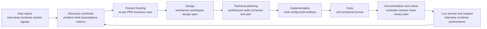
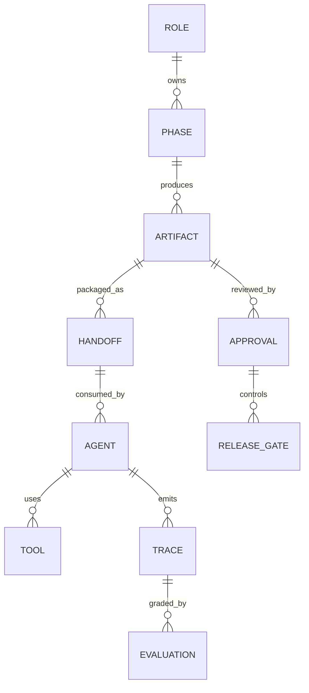

# From Stage Gates to Agent Handoffs

## Executive summary

The strongest parallel between traditional development pipelines and agentic engineering flows is not “automation,” but **artifact discipline**. Across civil and systems engineering, physical product development, and SaaS delivery, mature organizations learned to move work forward by turning raw upstream ambiguity into progressively more precise downstream artifacts: discovery syntheses, problem statements, business cases, design mocks, architecture decisions, code, tests, rollout plans, runbooks, and postmortems. Systems engineering standards describe lifecycle stages from conception through support and retirement; Stage-Gate formalizes stages and gates to reduce uncertainty; Agile and DevOps made iteration faster, but did not eliminate the need for phase-linked artifacts and decision criteria. citeturn11view8turn18search2turn15view0turn0search10turn15view2turn15view3turn11view6turn15view4

That same logic applies to agentic systems. Official guidance from Anthropic, OpenAI, Google, and Microsoft converges on a few themes: start with the simplest workflow that can work; use multi-agent systems only when specialization or true parallelism justifies the added orchestration cost; make handoffs explicit; require structured outputs; keep context scoped; trace everything; and insert human approval before risky side effects. Research systems such as MetaGPT and ChatDev explicitly model agent teams after human software organizations, with role-separated agents responsible for requirements, design, coding, and testing. citeturn26view0turn26view1turn29view2turn14view4turn14view5turn30view1turn29view1turn21view0turn21view1turn20view0

The most useful analytical additions are **Amdahl’s Law** and the **Theory of Constraints**. Amdahl’s Law says overall speedup is capped by the serial fraction of a system; adding more parallel workers never eliminates the non-parallel part. Theory of Constraints says system throughput is governed by the bottleneck; optimizing non-bottlenecks does not raise end-to-end output and can even create inventory, delay, or coordination waste. Those principles map cleanly onto agentic development: more subagents do not help when the real bottleneck is integration, approval, testing, or shared-context coordination. citeturn25view2turn23search10turn25view0turn25view1turn27view2turn29view1

The practical implication for a blog article is sharp: **artifacts are context-compaction devices**. Human pipelines already solved the problem “how do downstream specialists avoid wading through raw upstream context?” Agentic flows need the same answer. Do not hand a coding agent a raw customer interview transcript if what it actually needs is a task packet with constraints, APIs, acceptance criteria, risk boundaries, and required tests. Do not ask a planner and an implementer to share one giant undifferentiated context if they can exchange a typed handoff artifact instead. citeturn15view2turn16view1turn26view3turn27view2turn14view4

## Scope and assumptions

This report assumes no industry-specific regulatory constraint. It therefore compares three broad families of development practice: assurance-heavy engineered systems such as bridges and other infrastructure, cross-functional physical product development, and modern software/SaaS delivery. On the agentic side, it assumes software agents operating over text, code, documents, APIs, and tool environments, not embodied robotics. It also treats public summaries and abstracts of ISO-family standards as authoritative enough for lifecycle framing, because the full standard texts are not freely available in full detail on the public web. citeturn15view1turn15view0turn17search0turn17search7turn16view1turn16view2

Two limitations matter. First, some of the strongest public evidence on agentic workflows still comes from vendor engineering writeups and internal evaluations, which are useful but not the same as independent cross-vendor benchmarks. Second, several monitoring and agent-ops capabilities on vendor platforms remain in preview, so recommendations about production operations should be interpreted as directionally strong but implementation-specific. citeturn27view2turn31view0turn31view1turn30view0turn20view0

## Evolution of development paradigms across industries

The historical pattern is not a straight line from “waterfall” to “agile.” It is better understood as a sequence of **control strategies for uncertainty**. In systems engineering, the lifecycle is defined from conception through retirement, with decision-linked stages and explicit work products. The Vee model became a canonical representation because it ties early definition work to later integration, verification, and validation. In infrastructure, the bridge lifecycle is visibly long-lived and support-heavy: agencies plan, design, build, inspect, repair, rehabilitate, manage, and preserve assets over decades. citeturn11view8turn18search0turn18search3turn18search11turn15view1

In physical product development, the Stage-Gate model formalized the idea that innovation should move from discovery to launch through stages of parallel cross-functional work separated by gates that evaluate business merit and readiness. The key idea was not slowness for its own sake; it was **progressive uncertainty reduction** using specific deliverables and decision points. Stage-Gate’s later hybridization with agile methods shows that even when teams iterate faster, organizations still want gates, ownership, and visible deliverables. citeturn15view0turn0search10turn0search18

In SaaS and software, the shift was from scarce, expensive releases toward continuous delivery and live operations. The Agile Manifesto emphasized responsiveness, collaboration, and frequent delivery; service-delivery models such as GOV.UK’s discovery/alpha/beta/live/retirement sequence operationalized that into a public lifecycle; and Google’s release engineering and DORA research made deployment, operability, and recovery-time metrics first-class engineering concerns. Software lifecycle standards likewise frame the domain as conception, development, operation, support, and retirement rather than “coding only.” citeturn0search0turn0search8turn11view7turn15view2turn16view0turn15view3turn11view6turn15view4turn17search0turn34view1

The throughline across all three domains is that **specialization increases, but so does the need for shared artifacts**. Bridges rely on calculations, drawings, inspections, and preservation records. Product organizations rely on business cases, feasibility analyses, prototypes, and launch plans. SaaS teams rely on tickets, designs, APIs, code, tests, dashboards, and postmortems. Faster iteration did not remove artifacts; it made artifact quality more important because the handoff rate increased. citeturn15view1turn15view0turn11view6turn15view3

| Domain | Dominant control logic | Typical artifact chain | Why it matters |
|---|---|---|---|
| Bridge and infrastructure | Long life, safety, inspection, preservation | planning documents, design packages, construction records, inspection and preservation records | The lifecycle is long, capital intensive, and support-heavy, so artifacts must outlive the original builders. citeturn15view1turn11view8 |
| Physical product | Stage-and-gate uncertainty reduction | idea brief, feasibility, business case, prototype, launch plan, post-launch learning | Gates make cross-functional work legible and govern investment decisions. citeturn15view0turn0search18 |
| SaaS and digital service | Iterative delivery plus operational feedback loops | discovery output, design, architecture, code, tests, docs, rollout plan, dashboards, postmortems | Release engineering, metrics, and support become part of the lifecycle, not afterthoughts. citeturn11view7turn11view6turn15view4 |

## Canonical pipeline and artifact chain in human development

Across industries, the names differ, but the same end-to-end pattern keeps appearing: discovery produces a compacted model of user and business reality; framing turns that into a scoped decision to build; design turns that decision into an interaction or solution model; technical planning turns it into implementable structure; implementation turns it into a working change; testing turns it into evidence; rollout turns it into controlled exposure; support turns live behavior back into new research. That is why lifecycle standards describe stages as decision-linked and iterative rather than purely linear. citeturn11view8turn18search2turn17search0turn15view2turn15view3

| Phase | Typical inputs | Typical outputs and artifacts | Preferred handoff format | Best practices for compaction and artifact design |
|---|---|---|---|---|
| Research and discovery | User interviews, incident reports, market signals, policy or business goals, constraints | Problem statement, research synthesis, service map, personas or user segments, success metrics, assumptions list | Discovery brief, research readout, journey map, evidence log | Reframe solutions as problems to solve; quantify value and constraints; do not start building in discovery; separate evidence from assumptions. citeturn15view2turn16view1turn16view2 |
| Product framing | Discovery output, business strategy, constraints, portfolio context | Business case, PRD or equivalent, scope, non-goals, KPI definitions, investment decision | PRD, opportunity assessment, roadmap entry | Treat framing as a decision artifact, not a brainstorm dump; progressively reduce uncertainty and make gate criteria explicit. citeturn15view0turn15view2 |
| Design | User needs, framing artifact, constraints, accessibility requirements | Wireframes, prototypes, design spec, validated flows, accessibility findings | Wireframes, clickable prototypes, design annotations, acceptance criteria | Apply human-centred design throughout the lifecycle; prototype to test, not just to decorate; include accessibility from the start. citeturn16view1turn16view2turn16view0 |
| Technical planning | Approved scope, design outputs, system constraints, operational requirements | Architecture notes, task breakdown, API/data models, test plan, risk register, rollout plan | Architecture decision records, diagrams, schema specs, test strategy | Plan verification and validation early; involve release concerns early; define entry and exit criteria for each stage. citeturn18search9turn11view6turn11view9 |
| Implementation | Task-level spec, APIs, tests, coding standards | Code, migrations, configs, feature flags, build artifacts | PRs, commits, compiled artifacts, CI results | Favor reproducible automated release paths; use small batches; do not “throw code over the fence” to release and operations. citeturn11view6turn15view4 |
| Unit testing | Component specs and code units | Fast local test suite, fixtures, failure reports | CI checks, test artifacts | Shift left; write tests at the lowest useful level; keep them fast, isolated, and owned by code authors. citeturn33view1turn33view2 |
| Functional and integration testing | Integrated components, environments, flows, dependencies | Functional results, regression baselines, defect reports | Test plans and reports, pipeline jobs, defect records | Maintain known state and independence; isolate tests where possible; use heavier tests only when lower-level tests cannot provide the same signal. citeturn33view0turn33view2 |
| Human test plans and UAT | Near-production flows, prototypes or beta service, support scenarios | UAT signoff, usability findings, accessibility audit, support-readiness updates | Test script, audit report, annotated findings, signoff record | Test with real users, including disabled users where relevant; validate support models and cross-channel flows, not just the UI. citeturn16view0turn15view3turn33view0 |
| Documentation | Stable feature behavior, APIs, operational limits, support findings | User docs, API docs, runbooks, release notes, support scripts | Versioned docs, runbooks, release notes, call-center updates | Document defaults and operational assumptions; update support scripts and shared design patterns as part of release readiness. citeturn15view3turn11view6 |
| Rollout | Test evidence, release candidate, risk assessment, monitoring plan | Canary plan, approval record, dashboards, rollback procedure | Launch checklist, config bundle, monitor thresholds | Use canaries or progressive rollout; define evaluation criteria and rollback triggers before release. citeturn0search3turn11view6 |
| Support and operations | Live telemetry, tickets, failures, performance data | Incident records, postmortems, backlog input, roadmap adjustments | Dashboards, incident docs, postmortem, ops review | Run the service sustainably, monitor uptime and success metrics, keep testing security and performance in live operations. citeturn15view3turn15view4 |

A concise way to describe the whole system is this: every phase exists partly to **shield downstream specialists from raw upstream noise**. The programmer should not need the full interview transcript when a validated task packet will do; the support engineer should not need the architecture workshop transcript when a runbook and dashboard will do. That is not bureaucracy. It is loss-controlled compression. citeturn15view2turn16view2turn11view6turn15view3



## Agentic engineering flows and their parallels

The public platform guidance is strikingly aligned with the human pipeline logic. Anthropic distinguishes **workflows** from **agents**, advises teams to start with the simplest solution possible, and warns that more agentic complexity trades performance gains for extra cost and latency. Microsoft’s Agent Framework makes the same point in plainer terms: if a function can do the job, use a function; use agents for open-ended tasks and workflows for explicit orchestration. citeturn26view0turn26view1turn29view2

The explicit “human organization → agent team” mapping is already present in the literature. MetaGPT frames a software company as a multi-agent system and says it can take a one-line requirement and produce user stories, competitive analysis, requirements, data structures, APIs, and documents using product-manager, architect, project-manager, and engineer roles coordinated through SOPs. ChatDev likewise models software development as role-specialized agents working across design, coding, and testing, and explicitly situates itself against fragmented phase-by-phase automation. A newer software-engineering roadmap paper goes further by proposing a dual system of “software engineering for humans” and “software engineering for agents,” with purpose-built workbenches and handoff packs. citeturn22view0turn21view0turn21view1turn20view0

Anthropic’s own production engineering reports make the same case operationally rather than academically. Its research system uses an orchestrator-worker pattern where a lead agent plans, spawns subagents, keeps the plan in memory to avoid truncation, and relies on subagents to compress large independent searches into condensed results. Its long-running coding harness converged on a planner, generator, and evaluator architecture with structured artifacts used to carry state across context resets. Google’s ADK guidance describes similar patterns as sequential pipelines, coordinators, fan-out/fan-in, and human-in-the-loop approvals. citeturn27view2turn27view4turn26view6turn29view1turn14view8

The key difference from human pipelines is that agentic systems make the **context budget** explicit. Anthropic’s context-engineering guidance says the model has a finite attention budget and that effective context means finding the smallest set of high-signal tokens that maximize the odds of the desired outcome. That turns artifact design into a first-order systems problem rather than a side concern. In other words, the “artifact as compression” idea that was implicit in human organizations becomes mathematically unavoidable in agentic ones. citeturn26view3turn27view2

The comparison below is a synthesis of lifecycle sources, agent papers, and platform guidance. citeturn11view8turn15view2turn21view0turn21view1turn26view0turn29view1turn14view4

| Human flow | Human artifact | Agentic analogue | Recommended handoff artifact |
|---|---|---|---|
| Discovery researcher | Research synthesis | Lead-researcher brief or query planner | `research_brief.yaml` with objective, evidence, constraints, open questions, source refs |
| Product manager | PRD, business case | Planner or coordinator objective spec | `task_packet.json` with goal, non-goals, metrics, tool policy, output schema |
| Designer | Wireframe, prototype, UX spec | Solution-proposer or critic agent | structured design brief plus acceptance criteria |
| Architect / EM | Architecture doc, ADRs, task split | Orchestrator plan, work graph, tool routing plan | execution plan with subtask boundaries and escalation rules |
| Developer | PR, compiled change | Code-generation patch set | patch artifact plus required tests and changed files manifest |
| QA / user researcher | Test report, UAT findings | Eval run, trace grades, targeted human review | eval bundle with scores, failure traces, approval state |
| Release engineer / SRE | Canary plan, rollback plan | Deployment agent plus approvals and telemetry | rollout gate artifact with metrics, alert thresholds, rollback steps |
| Support / incident lead | Runbook, postmortem | Monitoring or remediation agent | incident packet with context snapshot, diffs, evidence, follow-up tasks |

The best agentic systems therefore look less like “one giant prompt” and more like a **software delivery organization with typed interfaces**. MCP formalizes typed access to prompts, resources, and tools via a schema-based protocol; A2A formalizes agent-to-agent interoperability; OpenAI structured outputs formalize JSON-Schema-constrained model outputs; and platform tracing systems formalize what happened during a run. These are all, in effect, **artifact contracts**. citeturn14view6turn14view7turn14view4turn14view5



## Constraints, bottlenecks, and operating models

### Amdahl’s Law as the limit on agent parallelism

Amdahl’s Law says that if a fraction of work must remain serial, the total speedup from adding parallel workers is capped by that serial part. IBM’s formulation makes the same point operationally: even with more processors, the maximum speedup is bounded by the sequential fraction, and parallel overhead can make things slower in practice. That is exactly the right mental model for multi-agent systems. citeturn25view2turn23search10

The mapping to agentic engineering is direct. Anthropic reports that multi-agent systems shine for breadth-first research, where many independent search branches can run in parallel, but are less compelling for domains where agents must share the same context or where dependencies are tight; it explicitly notes that coding tasks usually have fewer truly parallelizable tasks than research. Google’s ADK guidance makes the same distinction by offering a fan-out/gather pattern only when tasks are independent. citeturn27view2turn29view1

So, if only part of a software change can actually be parallelized by subagents, adding more planner/critic/coder/reviewer agents will hit diminishing returns quickly. Worse, the serial parts in real delivery systems are often not “coding” at all, but design decisions, approvals, human testing, rollout coordination, or integration environment availability. citeturn25view2turn15view3turn11view6

Illustrative Amdahl limits for agentic parallelism, using IBM’s formula: citeturn25view2turn32calculator0turn32calculator1turn32calculator2turn32calculator3turn32calculator4turn32calculator5

| Parallelizable share of work | 2 workers | 4 workers | 8 workers | Theoretical upper bound |
|---|---:|---:|---:|---:|
| 80% | 1.67× | 2.50× | 3.33× | 5.00× |
| 95% | 1.90× | 3.48× | 5.93× | 20.00× |

For blog framing, this is powerful: **the question is not “how many agents can I add?” but “what fraction of the delivery path is truly parallelizable without increasing coordination cost?”** That is the same question parallel computing asks about processors. citeturn25view2turn27view2

### Theory of Constraints as the limit on local optimization

Theory of Constraints argues that system performance is controlled by the constraint, that every system has a limiting factor, and that strengthening non-weakest links does not raise overall throughput and can make the system worse by increasing inventory or disorder. NIST’s recent Baldrige coverage uses the same language: only a few points govern pace and performance, so management attention should focus there. citeturn25view0turn25view1

That maps almost perfectly to both human and agentic development. If the bottleneck is user research throughput, better code generation does not help. If the bottleneck is environment provisioning, a faster planner just creates a queue. If the bottleneck is human approval for production-altering actions, speeding up subagents increases idle time upstream. Anthropic’s experience with over-spawning subagents, duplicate searches, and synchronous orchestration bottlenecks is a concrete example of this principle in production agent systems. citeturn25view0turn27view2

This is why DORA’s recent findings are relevant even in an AI-heavy world: AI adoption can improve individual productivity, but fundamentals such as small batch sizes, robust testing, stable priorities, and user-centricity still matter because throughput and stability are system properties, not local productivity metrics. citeturn15view5turn15view4

### Failure modes and the corresponding countermeasures

Most recurring agentic failures are familiar software-delivery failures in new clothes. Brittleness caused by over-specified prompts resembles overfit process scripts; vague prompts resemble underspecified tickets; bloated tool sets resemble overlapping APIs; and context overflow resembles asking too many people to reason from an uncontrolled, ever-growing transcript. Anthropic explicitly calls out brittle hardcoded prompts, vague prompting, ambiguous or bloated tool sets, context-window coherence loss, and “context anxiety.” It also documents practical failures such as over-spawning subagents, duplicate work, endless searching, and synchronous bottlenecks. citeturn26view3turn27view2turn27view4

OpenAI and Microsoft add the enterprise controls side: tracing, evals, guardrails, human review for sensitive tool calls, typed outputs, and workflow-level state management. In the same way that good software delivery uses CI, approvals, monitoring, and rollback, good agentic delivery relies on traces, graders, guardrails, approval pauses, and stateful resumability. citeturn14view3turn14view5turn30view1turn30view0turn29view2

The best-practice mapping below is synthesized from these sources. citeturn26view3turn27view2turn14view4turn30view1turn29view1turn29view2

| Anti-pattern | Human-pipeline analogue | Better practice |
|---|---|---|
| Passing raw transcripts directly to implementation | Sending every engineer raw interview recordings | Compress into a discovery brief with evidence, constraints, and decisions |
| One monolithic agent for everything | One team owning research, PM, design, QA, release, and support without interfaces | Separate roles where specialization is real, not cosmetic |
| Too many overlapping tools | Too many overlapping services or undocumented APIs | Minimize tool surface; make tool intent distinct and descriptions explicit |
| Schema-less outputs | Verbal handoffs and tribal knowledge | Use typed JSON/YAML artifacts with required fields and explicit non-goals |
| Over-parallelizing dependent work | Splitting a tightly coupled project across too many teams | Parallelize only independent branches; respect Amdahl limits |
| Optimizing non-bottlenecks | Local utilization metrics that increase WIP but not throughput | Identify the constraint first; subordinate the rest to it |
| No human approval on side effects | Direct prod deploys without release control | Add human review before deploys, edits, shell commands, financial actions, or sensitive updates |
| No traces or evals | Releasing without CI, logging, or post-release metrics | Trace runs, grade traces, run continuous evaluation, and monitor quality over time |
| Context compaction without durable state | Summarizing away critical rationale | Persist plans, findings, or intermediate artifacts outside the active context and pass references |

### Testing, rollout, monitoring, and artifact governance

A good comparison point is that **agent evals are not substitutes for software tests; they are the AI-era extension of them**. OpenAI defines evals as structured tests, recommends defining objectives, datasets, and metrics, then comparing runs over time; for agent workflows specifically it recommends starting with traces and graders to inspect model calls, tool calls, handoffs, and guardrails. Anthropic adds that complex agent evals are multi-turn and environment-dependent, and gives an example where a coding agent is graded with unit tests against a working MCP server. Microsoft’s evaluation guidance similarly separates quality, safety, and agent-behavior evaluators. citeturn14view2turn14view3turn14view1turn30view0

That implies an agentic testing stack that mirrors software delivery: low-level deterministic tests for artifacts and tools; functional workflow tests for end-to-end task completion; regression suites for prompt, tool, or model changes; and human evaluations for usability, trust, or business fit. Traditional software testing guidance still applies here: shift left where possible, keep low-level tests fast and reliable, and use heavier functional tests only when they are the cheapest credible signal. citeturn33view1turn33view2turn33view0turn14view2

Rollout and monitoring follow the same pattern. Google SRE recommends canarying with explicit evaluation criteria; Anthropic describes using rainbow deployments for highly stateful agent systems so running agents are not broken mid-flow; Microsoft Foundry emphasizes telemetry, continuous evaluations, alerts, red-team scans, and quality/safety metrics over production traffic. In other words, once agentic systems become live systems, they need the same release safety discipline as other production software, plus a stronger evaluation layer because behavior is nondeterministic. citeturn0search3turn27view2turn31view0turn31view1turn31view2

Artifact governance is where traditional engineering and agent engineering most obviously converge. MCP defines a schema-centric protocol for prompts, resources, and tools. A2A exists because large-scale multi-agent deployments need standardized agent-to-agent communication. OpenAI structured outputs exist because downstream systems need machine-checkable output contracts. NIST’s AI RMF and Generative AI Profile frame governance across design, development, deployment, use, and evaluation, which is exactly the lifecycle view needed when agent artifacts become operational control surfaces. The practical conclusion is that agent handoff artifacts need owners, schemas, versions, provenance, security boundaries, approval state, and retention rules. That last sentence is an inference, but it follows directly from the governance direction of these standards and platform capabilities. citeturn14view6turn14view7turn14view4turn30view1turn34view1turn34view0

## Recommended templates for artifacts and handoffs

The templates below are **synthesized recommendations**, not copied standards. They are derived from systems lifecycle work-product thinking, structured outputs and JSON Schema guidance, agent workflow tracing/evaluation guidance, MCP/A2A protocol thinking, and Anthropic’s recommendations for delegation boundaries, memory use, and compact high-signal context. citeturn11view8turn16view2turn14view4turn14view5turn14view6turn14view7turn26view3turn27view2

A strong handoff artifact should do five things at minimum: state the objective, define the boundaries, specify the expected output shape, preserve source provenance, and say what to do if confidence is low. That is as true for a PM-to-engineering handoff as it is for an orchestrator-to-subagent delegation. citeturn27view2turn14view4turn30view1

### Research brief template

```yaml
artifact_type: research_brief
version: 1
owner_role: researcher
status: draft
objective: >
  Understand the user problem and decide whether the team should proceed.
problem_statement: ""
target_users:
  - segment: ""
    goals: []
    pain_points: []
evidence:
  interviews:
    - source_ref: ""
      summary: ""
      confidence: high
  telemetry:
    - source_ref: ""
      finding: ""
constraints:
  business: []
  regulatory: []
  technical: []
assumptions:
  - ""
success_metrics:
  - name: ""
    baseline: ""
    target: ""
open_questions:
  - ""
recommended_next_step: proceed | iterate | stop
```

### Agent task packet template

```json
{
  "artifact_type": "task_packet",
  "version": 1,
  "owner_role": "planner",
  "task_id": "TASK-001",
  "objective": "Implement feature X behind a flag.",
  "inputs": {
    "product_spec_ref": "PRD-123",
    "design_spec_ref": "DESIGN-456",
    "api_schema_ref": "SCHEMA-789"
  },
  "non_goals": [
    "Do not change authentication flows",
    "Do not modify billing logic"
  ],
  "constraints": {
    "timebox": "4h",
    "allowed_tools": ["repo.read", "repo.write", "test.run", "lint.run"],
    "forbidden_actions": ["deploy.prod", "delete.migrations"]
  },
  "required_outputs": {
    "patch": true,
    "changed_files_manifest": true,
    "test_results": true,
    "risk_notes": true
  },
  "done_definition": [
    "Unit tests pass",
    "Functional tests updated if behavior changed",
    "Docs updated if user-visible behavior changed"
  ],
  "escalate_if": [
    "Requirements conflict",
    "No tool can verify the change",
    "Confidence below 0.7"
  ]
}
```

### Rollout gate template

```yaml
artifact_type: rollout_gate
version: 1
change_id: REL-2026-04-30-01
release_scope: ""
risk_level: low | medium | high
feature_flags:
  - name: ""
    default: off
test_evidence:
  unit: pass
  functional: pass
  human_eval: pending
  security_checks: pass
monitoring:
  success_metrics:
    - ""
  alert_thresholds:
    - ""
rollback_plan:
  trigger_conditions:
    - ""
  actions:
    - ""
approvals:
  engineering: pending
  product: pending
  operations: pending
notes: ""
```

### Sample handoff prompts

A planner-to-implementer prompt should be short, bounded, and typed. It should not attempt to re-embed the entire history if the artifact already contains the compacted state. That recommendation follows directly from current context-engineering guidance. citeturn26view3turn27view4

```text
You are the Implementer agent.

Read the attached task_packet.json and only use the references and tools listed there.
Your job is to produce:
1. a minimal patch,
2. test evidence,
3. a short risk note.

Do not broaden scope.
If requirements conflict, or if confidence drops below the escalation threshold, stop and return:
- issue_type
- missing_information
- recommended_next_question

Return output that matches the agreed schema exactly.
```

A lead-agent-to-subagent research prompt should specify objective, boundaries, output format, and stop conditions. Anthropic’s production guidance is explicit that subagents need objectives, output formats, tool guidance, and clear task boundaries to avoid duplicate work and gaps. citeturn27view2

```text
You are a Research Subagent.

Objective:
Identify evidence relevant to the assigned question only.

Boundaries:
- Search only the domains or sources listed in the brief.
- Do not explore adjacent topics unless they directly change the answer.
- Stop when you have either strong evidence or a clear explanation of why evidence is insufficient.

Required output:
- answer_summary
- evidence_items[]
- contradictions[]
- confidence
- follow_up_questions[]

Keep outputs concise and citation-ready.
```

## Key references

The most useful primary and original sources for the blog’s argument are these:

- **SEBoK lifecycle and Vee material** for the idea that engineered systems move through decision-linked lifecycle stages with work products that bridge conception, realization, support, and retirement. citeturn11view8turn18search0turn18search3  
- **FHWA bridge lifecycle guidance** for the infrastructure example and the long-lived support/inspection perspective. citeturn15view1  
- **Stage-Gate** for the physical-product model of explicit stages, gates, and uncertainty reduction. citeturn15view0turn0search10  
- **Agile Manifesto, GOV.UK delivery phases, ISO software lifecycle summaries, DORA, and Google SRE** for SaaS and modern software delivery. citeturn0search0turn11view7turn17search0turn15view4turn11view6  
- **Anthropic’s engineering posts** on building effective agents, context engineering, multi-agent research, harness design, tool design, and evals for the most detailed current public guidance on production agent systems. citeturn26view0turn26view3turn27view2turn27view4turn14view0turn14view1  
- **OpenAI structured outputs, evals, tracing, and guardrails docs** for typed artifacts, observability, and approval design. citeturn14view4turn14view5turn14view3turn30view1  
- **Google ADK and A2A guidance** for multi-agent patterns, event compaction, shared state, and interoperability. citeturn29view1turn14view7turn14view8turn28search0  
- **Microsoft Agent Framework and Foundry docs** for workflow-vs-agent distinctions, human approvals, evaluation, and monitoring. citeturn29view2turn30view2turn30view0turn31view0  
- **MetaGPT, ChatDev, and the recent Agentic Software Engineering roadmap paper** for explicit literature linking human software organizations to role-based agent collaboration. citeturn21view0turn21view1turn20view0turn22view0  
- **Amdahl and TOC sources** for the bottleneck and parallelism framing that sharpens the whole comparison. citeturn25view2turn23search10turn25view0turn25view1  

Open questions remain. Cross-vendor independent evidence for the best artifact shapes in agentic SDLCs is still thin, and some “agent ops” capabilities are evolving quickly enough that the precise tooling choices may age fast. But the central architectural claim is already well supported: **the future of agentic development probably looks less like replacing the SDLC and more like reifying it into explicit, typed, evaluable handoffs between humans and specialized agents.** citeturn20view0turn26view0turn14view4turn34view1